# Daily Diet API

## [Versão em Inglês](README.md)

## Descrição

A API Daily Diet é uma API RESTful projetada para gerenciar usuários e suas refeições. Ela permite que os usuários criem, editem e excluam seus perfis, bem como registrem suas refeições.

## Tecnologias

- Node.js
- Express.js
- Prisma
- PostgreSQL
- JWT para autenticação
- Swagger para documentação da API

## Diagrama de Fluxo da Aplicação

## Diagrama do Banco de Dados

## Configuração Local

1. Clone o repositório.
2. Instale as dependências: `npm install`
3. Configure seu arquivo `.env` com seu banco de dados e segredo JWT.
4. Execute as migrações do banco de dados: `prisma migrate dev --name init`
5. Inicie o servidor: `npm run start`

## Executando a Aplicação

1. Para iniciar a aplicação, execute `npm run start`.
2. A API estará disponível em `http://localhost:3000/api`.

## Documentação da API

Você pode acessar a documentação da API via Swagger em `http://localhost:3000/api-docs`.
